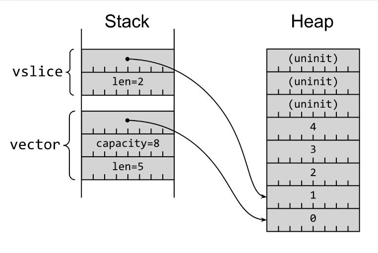

# Pointers and The Slice Type

When we call `[]` on a vector to reference some set of elements, we are actually returning a slice and not another vector.
A slice is just a region of contiguous data in memory.
However, in Rust, we don't typically store that region of data directly into a variable.
Instead we always *refer* to that region of data with the use of a pointer.
In the case of a slice, we use what's called a **fat pointer**, which is a two-word value comprising a pointer to the slice's first element and the number of elements in the slice.
Take a look at the diagram below.


<p><i>source: <a href="https://www.lurklurk.org/effective-rust/references.html">https://www.lurklurk.org/effective-rust/references.html</a></i></p>

### Stack and Heap
If you don't work in systems programming, you probably don't spend much time thinking about the stack and the heap, so let's provide a quick refresher here.
The stack is a region in memory that holds local variables during our program execution.
Those variables in turn can refer to, or *point to*, data on the heap which is a less structured area of memory available to our program.
When we need to store large amounts of data or a data type whose size can change during the runtime of our program, we typically allocate that data on the heap.
The heap is more flexible and less memory-constrained than the stack.
The heap also allows data to be accessed from anywhere in the program, which is useful for data shared across different functions or modules.
However, allocating to the heap comes with a cost.
It takes more time for the program to find the space in memory to allocate data and do some bookkeeping to return a pointer and prepare for the next allocation.
When the data needs to be accessed or updated, there is additional overhead to find the the data in memory and to also reallocate memory as needed.

Rust enforces that any type that is dynamically sized, meaning it can expand or shrink and its size is not known at compile time, must be allocated to the heap.
If the data size is known and fixed at compile time, and doesn't change during execution, it can be allocated on the stack.
This is for both memory safety and memory efficiency purposes.
Since pointers themselves are known and fixed in size they can be safely placed on our program's stack.
The underlying data they point to are allocated on the heap.

Notice in the diagram above how the vector is also a pointer type to data stored on the heap.
In Rust, the vector is actually just a *smart pointer*, unlike the slice, which is instead a *fat pointer*.
A smart pointer contains additional metadata and capabilities.
It also *owns* the data instead of just borrowing a reference to it.
We'll explore the concepts of borrowing and references in more detail later on.
For now, it's enough to understand the following key points:
1. Both vectors and slice references (often just called "slices" for short) **point** to the data in memory.
This makes it lightweight to pass around and move these data types in the program.
When they are moved, there is no need to move or copy the data on the heap as well.

2. A vector indicates ownership of the memory and a slice indicates a borrowing of memory.
One way to think about this is that when the vector goes out of scope and is no longer used or is "dropped", it has to deallocate all the data in memory as well.
So when the smart pointer is removed, all the underlying data on the heap must be removed as well.
The slice reference however can be "dropped" and the data it points to will remain in heap memory, since it is just borrowing the memory and doesn't own it.

Hopefully that made sense.
Don't worry if it feels a bit too complicated at the moment.
We'll get more familiar with these concepts as we progress in the course and get more practice.
It will eventually make sense.
I promise.

So let's return to the error we're getting.
`error[E0277]: the size for values of type [u8] cannot be known at compilation time`

In Rust, we cannot store dynamically sized data directly into a variable.
The program doesn't know until runtime how that data will grow or change and so Rust demands that we instead allocate that data on the heap instead of the stack.
Calling `[]` on a vector will return a region of dynamically-sized data, so we must always store a pointer reference to that data in a local variable.
We can do this by adding the `&` in front as the compiler suggested.
`&transaction_bytes[0..4]` is now a pointer and not the actual slice data on the heap.

See below for our modified program.
We've also added a `println!` in there to see what the version bytes looks like.

```rust
fn read_version(transaction_hex: &str) -> u32 {
    let transaction_bytes = hex::decode(transaction_hex).unwrap();
    let version_bytes = &transaction_bytes[0..4];
    println!("version bytes: {:?}", version_bytes);
    1
}

fn main() {
    let version = read_version("010000000242d5c1d6f7308bbe95c0f6e1301dd73a8da77d2155b0773bc297ac47f9cd7380010000006a4730440220771361aae55e84496b9e7b06e0a53dd122a1425f85840af7a52b20fa329816070220221dd92132e82ef9c133cb1a106b64893892a11acf2cfa1adb7698dcdc02f01b0121030077be25dc482e7f4abad60115416881fe4ef98af33c924cd8b20ca4e57e8bd5feffffff75c87cc5f3150eefc1c04c0246e7e0b370e64b17d6226c44b333a6f4ca14b49c000000006b483045022100e0d85fece671d367c8d442a96230954cdda4b9cf95e9edc763616d05d93e944302202330d520408d909575c5f6976cc405b3042673b601f4f2140b2e4d447e671c47012103c43afccd37aae7107f5a43f5b7b223d034e7583b77c8cd1084d86895a7341abffeffffff02ebb10f00000000001976a9144ef88a0b04e3ad6d1888da4be260d6735e0d308488ac508c1e000000000017a91476c0c8f2fc403c5edaea365f6a284317b9cdf7258700000000");
    println!("Version: {}", version);
}
```

*Note: for `println!` we can insert additional characters in the brackets to modify how the output is displayed.
`{:?}` will give us the debug output.
As long as the variable's type implements the `Debug` trait, we can see the debugging printout for that variable.
Not sure what a trait is?
Don't worry we'll talk about them a bit more in chapter 8.
For now, what this means is that only certain types offer a debug output.
Fortunately, the slice reference type is one of them.*

We can now see a printout of the bytes in addition to the version:

```shell
version bytes: [1, 0, 0, 0]
Version: 1
```

Great! Let's keep moving and calculate the version number from the byte collection.

### Quiz
*How is a String implemented in Rust?
How is it different from a string slice &str?*

### Additional Reading
* Stack and the Heap: https://doc.rust-lang.org/book/ch04-01-what-is-ownership.html#the-stack-and-the-heap
* References and Pointers: https://www.lurklurk.org/effective-rust/references.html
* Slices: https://doc.rust-lang.org/book/ch04-03-slices.html
* Smart Pointers: https://doc.rust-lang.org/book/ch15-00-smart-pointers.html

<hr/>

<div>
    <p align="right"><a href="07_arrays_and_conversions.md">>>> Next Lesson: Arrays and Type Conversions</a></p>
</div>
