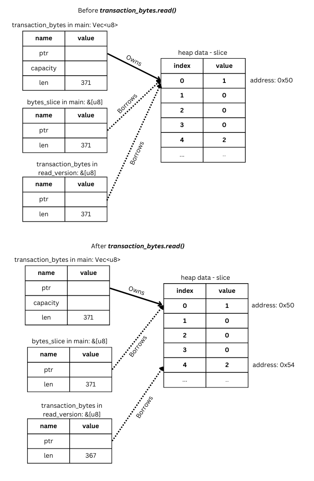
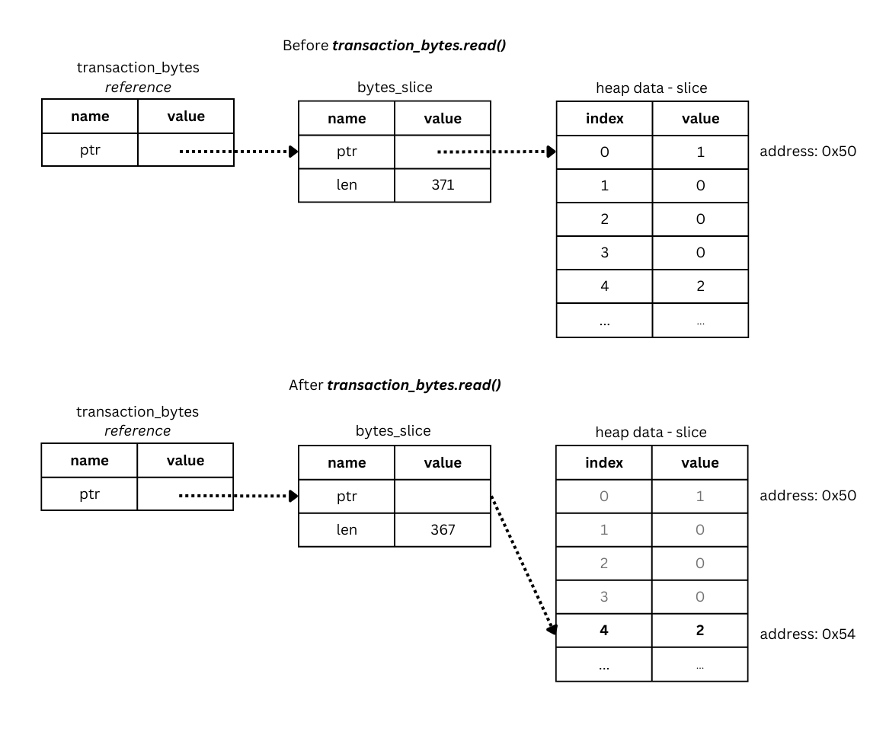

# Mutable References

So in the previous section, we were able to read the version by calling the `read` method to retrieve the first 4 bytes and then convert that into a `u32` integer. 
However, we want to keep track of where we are in the transaction so that we can continue to do decode it. 
In order to do that we'll want to pass in the bytes slice to the `read_version` function and then continue using it in the `main` function.

Let's experiment doing this similar to how we might coming from another programming language such as Python or Javascript.

We'll start by modifying the `main` function before updating our `read_version` function:
```rust
fn main() {
    let transaction_hex = "010000000242d5c1d6f7308bbe95c0f6e1301dd73a8da77d2155b0773bc297ac47f9cd7380010000006a4730440220771361aae55e84496b9e7b06e0a53dd122a1425f85840af7a52b20fa329816070220221dd92132e82ef9c133cb1a106b64893892a11acf2cfa1adb7698dcdc02f01b0121030077be25dc482e7f4abad60115416881fe4ef98af33c924cd8b20ca4e57e8bd5feffffff75c87cc5f3150eefc1c04c0246e7e0b370e64b17d6226c44b333a6f4ca14b49c000000006b483045022100e0d85fece671d367c8d442a96230954cdda4b9cf95e9edc763616d05d93e944302202330d520408d909575c5f6976cc405b3042673b601f4f2140b2e4d447e671c47012103c43afccd37aae7107f5a43f5b7b223d034e7583b77c8cd1084d86895a7341abffeffffff02ebb10f00000000001976a9144ef88a0b04e3ad6d1888da4be260d6735e0d308488ac508c1e000000000017a91476c0c8f2fc403c5edaea365f6a284317b9cdf7258700000000";
    let transaction_bytes = hex::decode(transaction_hex).unwrap();
    let mut bytes_slice = transaction_bytes.as_slice();
    let version = read_version(bytes_slice);

    println!("Version: {}", version);
}
```

Notice how we first decode the hex string to get a `vec` of bytes. We then convert that into a slice and then pass that into the `read_version` function.

We'll now have to modify the `read_version` function to accept the correct argument. What do you think is the correct type for the the argument? Take a moment and then check back here.

<hr/>

If you guessed it should be something like `&[u8]` you guessed correctly! This is the type signature for a slice of u8 integers. We'll see in a moment that this is not exactly the type we're looking for, but this is good enough for the moment. Let's take a look at what the modified `read_version` function looks like. 

```rust
fn read_version(transaction_bytes: &[u8]) -> u32 {
    let mut buffer = [0; 4];
    transaction_bytes.read(&mut buffer).unwrap();

    u32::from_le_bytes(buffer)
}
```

And let's see what happens if we try to compile this program.

We should get an error that looks like the following:
```shell
8 |     transaction_bytes.read(&mut buffer).unwrap();
  |     ^^^^^^^^^^^^^^^^^ cannot borrow as mutable
  |
help: consider changing this to be mutable
  |
4 | fn read_version(mut transaction_bytes: &[u8]) -> u32 {
  |                    +++
```

Remember, if we're going to modify a variable, we have to declare that it is mutable using the `mut` keyword. The compiler is suggesting that we add `mut` to the beginning of the `transaction_bytes` argument. Let's try that and see what happens.

```rust
fn read_version(mut transaction_bytes: &[u8]) -> u32 {
    let mut buffer = [0; 4];
    transaction_bytes.read(&mut buffer).unwrap();

    u32::from_le_bytes(buffer)
}
```

Ok that successfully compiles now! Great.

But is this what we actually want? Let's see what happens if we continue to call the `read` method in `main` function. It should pick up where it left off, reading the next byte to get the input count. Remember, the input count is what comes next after the version for a legacy (pre-segwit) transaction.

If we eyeball the transaction hex, we should be able to see what the correct input count is. Let's take a look at this more closely:
```
*01000000* *02* 42d5c1d6f7308bbe95c0f6e1301dd73a8da77d2155b0773bc297ac47f9cd7380010000006a4730440220771361aae55e84496b9e7b06e0a53dd122a1425f85840af7a52b20fa329816070220221dd92132e82ef9c133cb1a106b64893892a11acf2cfa1adb7698dcdc02f01b0121030077be25dc482e7f4abad60115416881fe4ef98af33c924cd8b20ca4e57e8bd5feffffff75c87cc5f3150eefc1c04c0246e7e0b370e64b17d6226c44b333a6f4ca14b49c000000006b483045022100e0d85fece671d367c8d442a96230954cdda4b9cf95e9edc763616d05d93e944302202330d520408d909575c5f6976cc405b3042673b601f4f2140b2e4d447e671c47012103c43afccd37aae7107f5a43f5b7b223d034e7583b77c8cd1084d86895a7341abffeffffff02ebb10f00000000001976a9144ef88a0b04e3ad6d1888da4be260d6735e0d308488ac508c1e000000000017a91476c0c8f2fc403c5edaea365f6a284317b9cdf7258700000000
```

The first 8 hex characters, which represent the first 4 bytes, clearly show a version 1 transaction. The next byte is `02` as you can see. So if we continue reading the transaction in the main function, we should get an input count of 2. Let's see if that's what happens.

We'll print out the next byte, which should be `2_u8`. We can actually leverage the `assert!` macro to confirm this. This line will ensure that the next byte is actually the u8 value of 2 or panic, stop the program and print an error. 

```rust
fn main() {
    let transaction_hex = "010000000242d5c1d6f7308bbe95c0f6e1301dd73a8da77d2155b0773bc297ac47f9cd7380010000006a4730440220771361aae55e84496b9e7b06e0a53dd122a1425f85840af7a52b20fa329816070220221dd92132e82ef9c133cb1a106b64893892a11acf2cfa1adb7698dcdc02f01b0121030077be25dc482e7f4abad60115416881fe4ef98af33c924cd8b20ca4e57e8bd5feffffff75c87cc5f3150eefc1c04c0246e7e0b370e64b17d6226c44b333a6f4ca14b49c000000006b483045022100e0d85fece671d367c8d442a96230954cdda4b9cf95e9edc763616d05d93e944302202330d520408d909575c5f6976cc405b3042673b601f4f2140b2e4d447e671c47012103c43afccd37aae7107f5a43f5b7b223d034e7583b77c8cd1084d86895a7341abffeffffff02ebb10f00000000001976a9144ef88a0b04e3ad6d1888da4be260d6735e0d308488ac508c1e000000000017a91476c0c8f2fc403c5edaea365f6a284317b9cdf7258700000000";
    let transaction_bytes = hex::decode(transaction_hex).unwrap();
    let mut bytes_slice = transaction_bytes.as_slice();
    let version = read_version(bytes_slice);
    println!("Version: {}", version);

    let mut input_count = [0; 1];
    bytes_slice.read(&mut input_count).unwrap();
    assert_eq!(input_count, [2_u8]);
}
```

If we run this, we'll get an assertion error. And it will show that the input count is 1 instead of 2.

```console
Version: 1
thread 'main' panicked at src/main.rs:19:5:
assertion `left == right` failed
  left: [1]
 right: [2]
```

Why might that be? 

Let's print out the debug output of `bytes_slice` and see what it looks like. Since we read the first 4 bytes, those should no longer be there, and the slice should start with 2.

```rust
fn main() {
    let transaction_hex = "010000000242d5c1d6f7308bbe95c0f6e1301dd73a8da77d2155b0773bc297ac47f9cd7380010000006a4730440220771361aae55e84496b9e7b06e0a53dd122a1425f85840af7a52b20fa329816070220221dd92132e82ef9c133cb1a106b64893892a11acf2cfa1adb7698dcdc02f01b0121030077be25dc482e7f4abad60115416881fe4ef98af33c924cd8b20ca4e57e8bd5feffffff75c87cc5f3150eefc1c04c0246e7e0b370e64b17d6226c44b333a6f4ca14b49c000000006b483045022100e0d85fece671d367c8d442a96230954cdda4b9cf95e9edc763616d05d93e944302202330d520408d909575c5f6976cc405b3042673b601f4f2140b2e4d447e671c47012103c43afccd37aae7107f5a43f5b7b223d034e7583b77c8cd1084d86895a7341abffeffffff02ebb10f00000000001976a9144ef88a0b04e3ad6d1888da4be260d6735e0d308488ac508c1e000000000017a91476c0c8f2fc403c5edaea365f6a284317b9cdf7258700000000";
    let transaction_bytes = hex::decode(transaction_hex).unwrap();
    let mut bytes_slice = transaction_bytes.as_slice();
    let version = read_version(bytes_slice);
    println!("Version: {}", version);

    println!("bytes_slice: {:?}", bytes_slice); // first 4 bytes [1, 0, 0, 0] should no longer be returned after calling `read_version`.

    let mut input_count = [0; 1];
    bytes_slice.read(&mut input_count).unwrap();
    assert_eq!(input_count, [2_u8]);
}
```

When we print the `bytes_slice`, we see the `[1,0,0,0]` is still there at the beginning. But this should have been `read` and the pointer should have moved so that this portion is no longer returned by the slice. So what's happening here exactly? 

As it turns out, the slice in the `read_version` is not modifying the same slice in the `main` function. It's just a *copy* of it. So when we modify it in the `read_version` function, we are not modifying the same one in the `main` version. If we want to modify the same one, we need a *mutable reference* to it. The *reference* will link our variable in `read_version` to the slice in the `main` function.

Let's add some print statements to see this more clearly. We're going to use a new format specifier, `{:p}` which instead of printing the debug output as we normally do, will print the address in memory of the heap data that the slices point to. This will let us know whether the slice in the `read_version` function ends up pointing to the same heap data as the one in `main` function. If it is, it should print the same address location in memory.

We're going to add four `println!` statements to show us how the memory address of our slice is changing in both functions. We'll also print out our slices in both functions to see what they look like. 

```rust
use std::io::Read;

fn read_version(mut transaction_bytes: &[u8]) -> u32 {
    println!("transaction_bytes memory address before reading {:p}", transaction_bytes);

    let mut buffer = [0; 4];
    transaction_bytes.read(&mut buffer).unwrap();
    
    println!("transaction bytes memory address after reading {:p}\n", transaction_bytes);
    println!("transaction bytes: {:?}\n", transaction_bytes);

    u32::from_le_bytes(buffer)
}

fn main() {
    let transaction_hex = "010000000242d5c1d6f7308bbe95c0f6e1301dd73a8da77d2155b0773bc297ac47f9cd7380010000006a4730440220771361aae55e84496b9e7b06e0a53dd122a1425f85840af7a52b20fa329816070220221dd92132e82ef9c133cb1a106b64893892a11acf2cfa1adb7698dcdc02f01b0121030077be25dc482e7f4abad60115416881fe4ef98af33c924cd8b20ca4e57e8bd5feffffff75c87cc5f3150eefc1c04c0246e7e0b370e64b17d6226c44b333a6f4ca14b49c000000006b483045022100e0d85fece671d367c8d442a96230954cdda4b9cf95e9edc763616d05d93e944302202330d520408d909575c5f6976cc405b3042673b601f4f2140b2e4d447e671c47012103c43afccd37aae7107f5a43f5b7b223d034e7583b77c8cd1084d86895a7341abffeffffff02ebb10f00000000001976a9144ef88a0b04e3ad6d1888da4be260d6735e0d308488ac508c1e000000000017a91476c0c8f2fc403c5edaea365f6a284317b9cdf7258700000000";
    let transaction_bytes = hex::decode(transaction_hex).unwrap();
    let mut bytes_slice = transaction_bytes.as_slice();
    
    println!("bytes slice memory address before calling read_version: {:p}\n", bytes_slice);
    
    let version = read_version(bytes_slice);
    
    println!("bytes slice memory address after calling read_version: {:p}\n", bytes_slice);
    println!("bytes slice after calling read_version: {:?}", bytes_slice);
    println!("Version: {}", version);

    let mut input_count = [0; 1];
    bytes_slice.read(&mut input_count).unwrap();
    assert_eq!(input_count, [2_u8]);
}
```

Let's run this and look at the output.
```console
bytes slice memory address before calling read_version: 0x50

transaction_bytes memory address before reading 0x50
transaction bytes memory address after reading 0x54

transaction bytes: [2, 66, 213, 193, 214, 247, 48, 139, 190, 149, 192, 246, 225, 48, 29, 215, 58, 141, 167, 125, 33, 85, 176, 119, 59, 194, 151, 172, 71, 249, 205, 115, 128, 1, 0, 0, 0, 106, 71, 48, 68, 2, 32, 119, 19, 97, 170, 229, 94, 132, 73, 107, 158, 123, 6, 224, 165, 61, 209, 34, 161, 66, 95, 133, 132, 10, 247, 165, 43, 32, 250, 50, 152, 22, 7, 2, 32, 34, 29, 217, 33, 50, 232, 46, 249, 193, 51, 203, 26, 16, 107, 100, 137, 56, 146, 161, 26, 207, 44, 250, 26, 219, 118, 152, 220, 220, 2, 240, 27, 1, 33, 3, 0, 119, 190, 37, 220, 72, 46, 127, 74, 186, 214, 1, 21, 65, 104, 129, 254, 78, 249, 138, 243, 60, 146, 76, 216, 178, 12, 164, 229, 126, 139, 213, 254, 255, 255, 255, 117, 200, 124, 197, 243, 21, 14, 239, 193, 192, 76, 2, 70, 231, 224, 179, 112, 230, 75, 23, 214, 34, 108, 68, 179, 51, 166, 244, 202, 20, 180, 156, 0, 0, 0, 0, 107, 72, 48, 69, 2, 33, 0, 224, 216, 95, 236, 230, 113, 211, 103, 200, 212, 66, 169, 98, 48, 149, 76, 221, 164, 185, 207, 149, 233, 237, 199, 99, 97, 109, 5, 217, 62, 148, 67, 2, 32, 35, 48, 213, 32, 64, 141, 144, 149, 117, 197, 246, 151, 108, 196, 5, 179, 4, 38, 115, 182, 1, 244, 242, 20, 11, 46, 77, 68, 126, 103, 28, 71, 1, 33, 3, 196, 58, 252, 205, 55, 170, 231, 16, 127, 90, 67, 245, 183, 178, 35, 208, 52, 231, 88, 59, 119, 200, 205, 16, 132, 216, 104, 149, 167, 52, 26, 191, 254, 255, 255, 255, 2, 235, 177, 15, 0, 0, 0, 0, 0, 25, 118, 169, 20, 78, 248, 138, 11, 4, 227, 173, 109, 24, 136, 218, 75, 226, 96, 214, 115, 94, 13, 48, 132, 136, 172, 80, 140, 30, 0, 0, 0, 0, 0, 23, 169, 20, 118, 192, 200, 242, 252, 64, 60, 94, 218, 234, 54, 95, 106, 40, 67, 23, 185, 205, 247, 37, 135, 0, 0, 0, 0]

bytes slice memory address after calling read_version: 0x50

bytes slice: [1, 0, 0, 0, 2, 66, 213, 193, 214, 247, 48, 139, 190, 149, 192, 246, 225, 48, 29, 215, 58, 141, 167, 125, 33, 85, 176, 119, 59, 194, 151, 172, 71, 249, 205, 115, 128, 1, 0, 0, 0, 106, 71, 48, 68, 2, 32, 119, 19, 97, 170, 229, 94, 132, 73, 107, 158, 123, 6, 224, 165, 61, 209, 34, 161, 66, 95, 133, 132, 10, 247, 165, 43, 32, 250, 50, 152, 22, 7, 2, 32, 34, 29, 217, 33, 50, 232, 46, 249, 193, 51, 203, 26, 16, 107, 100, 137, 56, 146, 161, 26, 207, 44, 250, 26, 219, 118, 152, 220, 220, 2, 240, 27, 1, 33, 3, 0, 119, 190, 37, 220, 72, 46, 127, 74, 186, 214, 1, 21, 65, 104, 129, 254, 78, 249, 138, 243, 60, 146, 76, 216, 178, 12, 164, 229, 126, 139, 213, 254, 255, 255, 255, 117, 200, 124, 197, 243, 21, 14, 239, 193, 192, 76, 2, 70, 231, 224, 179, 112, 230, 75, 23, 214, 34, 108, 68, 179, 51, 166, 244, 202, 20, 180, 156, 0, 0, 0, 0, 107, 72, 48, 69, 2, 33, 0, 224, 216, 95, 236, 230, 113, 211, 103, 200, 212, 66, 169, 98, 48, 149, 76, 221, 164, 185, 207, 149, 233, 237, 199, 99, 97, 109, 5, 217, 62, 148, 67, 2, 32, 35, 48, 213, 32, 64, 141, 144, 149, 117, 197, 246, 151, 108, 196, 5, 179, 4, 38, 115, 182, 1, 244, 242, 20, 11, 46, 77, 68, 126, 103, 28, 71, 1, 33, 3, 196, 58, 252, 205, 55, 170, 231, 16, 127, 90, 67, 245, 183, 178, 35, 208, 52, 231, 88, 59, 119, 200, 205, 16, 132, 216, 104, 149, 167, 52, 26, 191, 254, 255, 255, 255, 2, 235, 177, 15, 0, 0, 0, 0, 0, 25, 118, 169, 20, 78, 248, 138, 11, 4, 227, 173, 109, 24, 136, 218, 75, 226, 96, 214, 115, 94, 13, 48, 132, 136, 172, 80, 140, 30, 0, 0, 0, 0, 0, 23, 169, 20, 118, 192, 200, 242, 252, 64, 60, 94, 218, 234, 54, 95, 106, 40, 67, 23, 185, 205, 247, 37, 135, 0, 0, 0, 0]
```

Notice how `transaction_bytes` points to the same memory address as our slice in the `main` function and after being modified points to a new memory address. Our `bytes_slice` in the `main` function should also have changed, but it does not and remains the same. We can see that the slice in the `read_version` function no longer returns the first 4 bytes, `[1, 0, 0, 0]` after being read, whereas the one in the `main` function still does.

The slice in the `main` function is no longer the same as the one in the `read_version` function. What's happening here is that in the `read_version` function the local variable is being changed without modifying the slice in `main`. The `transaction_bytes` variable is being treated as a mutable *copy* and not a mutable *reference*. That's not what we want. We want to change the original slice in `main` as well. 

Here is a diagram that helps to visualize what's happening above:


What we really want to do is pass around a reference so that there is a link between the variable in `read_version` and the one in `main`. We can indicate that something is a mutable reference by prepending the `&mut` keyword. 

Instead of the argument type being `mut transaction_bytes: &[u8]`, we want the the `transaction_bytes` variable to be of the type `&mut &[u8]`. 

These are the two different function signatures:
```rust
fn read_version(mut transaction_bytes: &[u8]) -> u32
fn read_version(transaction_bytes: &mut &[u8]) -> u32
```
Notice how the `mut` keyword appears before the argument name in the first one and as part of the type specification in the second. This might be a bit confusing, but one is modifying the argument for the specific function whereas the other is specifying what the argument type is. One is an internal specification, whereas the argument type indicates what the function should receive from the outside.

The first function can be read as: "this function expects to receive a variable with the specific type being an *immutable* slice, but will make a *mutable* copy of it locally just for this function".
The second one on the other hand can be read as follows: "this function expects to receive a variable with the specific type being a *mutable* reference to a slice".

Let's update our functions with this understanding, passing a *mutable reference* instead.

```rust
use std::io::Read;

fn read_version(transaction_bytes: &mut &[u8]) -> u32 { // the argument type is a mutable reference to a slice of u8 integers
    println!("transaction_bytes memory address before reading {:p}", *transaction_bytes); // make sure to dereference the transaction_bytes variable to see the memory address of the object it is referring to
    let mut buffer = [0; 4];
    transaction_bytes.read(&mut buffer).unwrap();

    println!("transaction bytes memory address after reading {:p}\n", *transaction_bytes);
    println!("transaction bytes: {:?}\n", transaction_bytes);

    u32::from_le_bytes(buffer)
}

fn main() {
    let transaction_hex = "010000000242d5c1d6f7308bbe95c0f6e1301dd73a8da77d2155b0773bc297ac47f9cd7380010000006a4730440220771361aae55e84496b9e7b06e0a53dd122a1425f85840af7a52b20fa329816070220221dd92132e82ef9c133cb1a106b64893892a11acf2cfa1adb7698dcdc02f01b0121030077be25dc482e7f4abad60115416881fe4ef98af33c924cd8b20ca4e57e8bd5feffffff75c87cc5f3150eefc1c04c0246e7e0b370e64b17d6226c44b333a6f4ca14b49c000000006b483045022100e0d85fece671d367c8d442a96230954cdda4b9cf95e9edc763616d05d93e944302202330d520408d909575c5f6976cc405b3042673b601f4f2140b2e4d447e671c47012103c43afccd37aae7107f5a43f5b7b223d034e7583b77c8cd1084d86895a7341abffeffffff02ebb10f00000000001976a9144ef88a0b04e3ad6d1888da4be260d6735e0d308488ac508c1e000000000017a91476c0c8f2fc403c5edaea365f6a284317b9cdf7258700000000";
    let transaction_bytes = hex::decode(transaction_hex).unwrap();
    let mut bytes_slice = transaction_bytes.as_slice();
    
    println!("bytes slice memory address before calling read_version: {:p}\n", bytes_slice);
    
    let version = read_version(&mut bytes_slice); // pass in a mutable reference to the bytes_slice
    
    println!("bytes slice memory address after calling read_version: {:p}\n", bytes_slice);
    println!("bytes slice after calling read_version: {:?}", bytes_slice);
    println!("Version: {}", version);

    let mut input_count = [0; 1];
    bytes_slice.read(&mut input_count).unwrap();
    assert_eq!(input_count, [2_u8]);
}
```

A few things to note here:

1. It might be a bit odd to see the two `&`s together for the argument type in the `read_version` function signature, `&mut &[u8]`. As a reminder, the `&[u8]` indicates a slice type, which is simply a *pointer* to some heap-allocated data. The `&mut` indicates that we are passing a mutable reference to this slice (which is also a kind of pointer). So what this really represents is a mutable *reference* to a fat pointer. The slice *pointer* is what's being modified, rather than the data in heap memory that it points to.

2. The second thing to note is that when we print the memory address of the `transaction_bytes` in the `read_version` function, we need to first *dereference* it. If we don't do that, we'll still get a different memory address. This makes sense as the reference and the object it refers to are two separate things. In order to dereference a reference and access the underlying object, we can add a `*` in front, which you'll notice in the `println!` statement above as `*transaction_bytes`.

3. We need to pass in a mutable reference to the `read_version` function call in `main`. `let version = read_version(&mut bytes_slice);`

So what happens if we run this now? Run it and see.

You should now get exactly what you expect. The memory address ends up being the same and the slice in the `main` function has been updated. It no longer returns the first 4 bytes and the first item is the integer, `2`. 

```console
bytes slice memory address before calling read_version: 0x50

transaction_bytes memory address before reading 0x50
transaction bytes memory address after reading 0x54

transaction bytes: [2, 66, 213, 193, 214, 247, 48, 139, 190, 149, 192, 246, 225, 48, 29, 215, 58, 141, 167, 125, 33, 85, 176, 119, 59, 194, 151, 172, 71, 249, 205, 115, 128, 1, 0, 0, 0, 106, 71, 48, 68, 2, 32, 119, 19, 97, 170, 229, 94, 132, 73, 107, 158, 123, 6, 224, 165, 61, 209, 34, 161, 66, 95, 133, 132, 10, 247, 165, 43, 32, 250, 50, 152, 22, 7, 2, 32, 34, 29, 217, 33, 50, 232, 46, 249, 193, 51, 203, 26, 16, 107, 100, 137, 56, 146, 161, 26, 207, 44, 250, 26, 219, 118, 152, 220, 220, 2, 240, 27, 1, 33, 3, 0, 119, 190, 37, 220, 72, 46, 127, 74, 186, 214, 1, 21, 65, 104, 129, 254, 78, 249, 138, 243, 60, 146, 76, 216, 178, 12, 164, 229, 126, 139, 213, 254, 255, 255, 255, 117, 200, 124, 197, 243, 21, 14, 239, 193, 192, 76, 2, 70, 231, 224, 179, 112, 230, 75, 23, 214, 34, 108, 68, 179, 51, 166, 244, 202, 20, 180, 156, 0, 0, 0, 0, 107, 72, 48, 69, 2, 33, 0, 224, 216, 95, 236, 230, 113, 211, 103, 200, 212, 66, 169, 98, 48, 149, 76, 221, 164, 185, 207, 149, 233, 237, 199, 99, 97, 109, 5, 217, 62, 148, 67, 2, 32, 35, 48, 213, 32, 64, 141, 144, 149, 117, 197, 246, 151, 108, 196, 5, 179, 4, 38, 115, 182, 1, 244, 242, 20, 11, 46, 77, 68, 126, 103, 28, 71, 1, 33, 3, 196, 58, 252, 205, 55, 170, 231, 16, 127, 90, 67, 245, 183, 178, 35, 208, 52, 231, 88, 59, 119, 200, 205, 16, 132, 216, 104, 149, 167, 52, 26, 191, 254, 255, 255, 255, 2, 235, 177, 15, 0, 0, 0, 0, 0, 25, 118, 169, 20, 78, 248, 138, 11, 4, 227, 173, 109, 24, 136, 218, 75, 226, 96, 214, 115, 94, 13, 48, 132, 136, 172, 80, 140, 30, 0, 0, 0, 0, 0, 23, 169, 20, 118, 192, 200, 242, 252, 64, 60, 94, 218, 234, 54, 95, 106, 40, 67, 23, 185, 205, 247, 37, 135, 0, 0, 0, 0]

bytes slice memory address after calling read_version: 0x54

bytes slice after calling read_version: [2, 66, 213, 193, 214, 247, 48, 139, 190, 149, 192, 246, 225, 48, 29, 215, 58, 141, 167, 125, 33, 85, 176, 119, 59, 194, 151, 172, 71, 249, 205, 115, 128, 1, 0, 0, 0, 106, 71, 48, 68, 2, 32, 119, 19, 97, 170, 229, 94, 132, 73, 107, 158, 123, 6, 224, 165, 61, 209, 34, 161, 66, 95, 133, 132, 10, 247, 165, 43, 32, 250, 50, 152, 22, 7, 2, 32, 34, 29, 217, 33, 50, 232, 46, 249, 193, 51, 203, 26, 16, 107, 100, 137, 56, 146, 161, 26, 207, 44, 250, 26, 219, 118, 152, 220, 220, 2, 240, 27, 1, 33, 3, 0, 119, 190, 37, 220, 72, 46, 127, 74, 186, 214, 1, 21, 65, 104, 129, 254, 78, 249, 138, 243, 60, 146, 76, 216, 178, 12, 164, 229, 126, 139, 213, 254, 255, 255, 255, 117, 200, 124, 197, 243, 21, 14, 239, 193, 192, 76, 2, 70, 231, 224, 179, 112, 230, 75, 23, 214, 34, 108, 68, 179, 51, 166, 244, 202, 20, 180, 156, 0, 0, 0, 0, 107, 72, 48, 69, 2, 33, 0, 224, 216, 95, 236, 230, 113, 211, 103, 200, 212, 66, 169, 98, 48, 149, 76, 221, 164, 185, 207, 149, 233, 237, 199, 99, 97, 109, 5, 217, 62, 148, 67, 2, 32, 35, 48, 213, 32, 64, 141, 144, 149, 117, 197, 246, 151, 108, 196, 5, 179, 4, 38, 115, 182, 1, 244, 242, 20, 11, 46, 77, 68, 126, 103, 28, 71, 1, 33, 3, 196, 58, 252, 205, 55, 170, 231, 16, 127, 90, 67, 245, 183, 178, 35, 208, 52, 231, 88, 59, 119, 200, 205, 16, 132, 216, 104, 149, 167, 52, 26, 191, 254, 255, 255, 255, 2, 235, 177, 15, 0, 0, 0, 0, 0, 25, 118, 169, 20, 78, 248, 138, 11, 4, 227, 173, 109, 24, 136, 218, 75, 226, 96, 214, 115, 94, 13, 48, 132, 136, 172, 80, 140, 30, 0, 0, 0, 0, 0, 23, 169, 20, 118, 192, 200, 242, 252, 64, 60, 94, 218, 234, 54, 95, 106, 40, 67, 23, 185, 205, 247, 37, 135, 0, 0, 0, 0]
Version: 1
```

When `transaction_bytes.read` is run, Rust is automatically dereferencing the reference pointer. It follows the reference from `transaction_bytes`, finds the `bytes_slice` from `main` and then calls the `read` method on that. `bytes_slice` gets updated and then `transaction_bytes` continues to refer to the newly modified slice. Here is a diagram to help visualize what is happening in our `read_version` function:



Dereferencing is something Rust does automatically anytime there is a method call. It checks to see if the variable can be dereferenced into something else. This is the equivalent of manually prepending the variable with the `*` operator. In fact, the `*` operator is shorthand for calling the `deref` method of the [`Deref` trait implementation](https://doc.rust-lang.org/std/ops/trait.Deref.html). So types can implement the `Deref` trait and be dereferenced into other types whenever method calls are made. 

Great work so far. It may not seem like much code, but you've learned a ton of Rust fundamentals. And this is one of the hardest concepts to grasp in Rust!

Let's explore this concept some more in the next section 9.1 and review the differences between shared and mutable references as well as borrowing vs ownership. See you there!

### Quiz
*You will find that certain methods for manipulating the elements of a vector such as sorting are available only on the slice type and not the vector. However, if you call `.sort` on a vector, it will still work. Why is that?* <br/>
https://doc.rust-lang.org/std/vec/struct.Vec.html <br/>
https://doc.rust-lang.org/std/primitive.slice.html#method.sort <br/>

### Additional Reading
* Mutability: https://exercism.org/tracks/rust/concepts/mutability
* Ownership and References: https://doc.rust-lang.org/book/ch04-01-what-is-ownership.html

<hr/>

<div>
    <p align="right"><a href="09_01_shared_references.md">>>> Next Lesson: Shared References</a></p>
</div>
