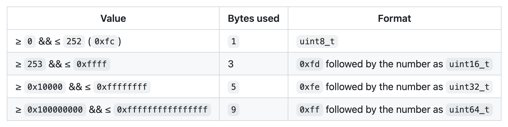

# Compact Size Unsigned Integers

We'll talk more about the Segwit soft fork and how the transaction format changed later on in this course. For now, we're going to assume the transactions we're decoding are serialized according to the legacy, pre-segwit format. This means the next field after the version will be the number of inputs. 

If you have read [Mastering Bitcoin 3rd Edition, Chapter 6](https://github.com/bitcoinbook/bitcoinbook/blob/develop/ch06_transactions.adoc#length-of-transaction-input-list), you'll remember that the next byte represents the length of the transaction input list encoded as a compactSize usigned integer. The compactSize integer indicates how many bytes to read to determine the number of inputs. For example, if the length is less than 253, then the next byte is simply interpreted as an unsigned 8-bit integer (the `u8` data type in Rust). If the length is greater than 252 and less than 2^16, then we would expect to see the byte `fd` (or the integer 253) followed by two additional bytes interpreted as a `u16` integer, etc. This is the table we can use as reference:



So let's write a function to read a compactSize unsigned integer. Let's think about this a bit. What kind of argument do we want to accept? And what should the return type be? Take a moment to fill out the function signature and come back.

----------------------------------------------------------------------------------------------------

For the argument type, we have to remember that we're still passing around the same mutable reference to the slice so that we can keep reading it and moving the pointer. So we'll keep the same argument type as in the `read_version` function.

Now, what should the return type be? Well, the input length can be an 8-bit, 16-bit, 32-bit or a 64-bit unsigned integer? So if we need to specify just one type for the length, let's choose the highest one as it will contain any other possibility.

```rust
fn read_compact_size(transaction_bytes: &mut &[u8]) -> u64 {
    // unimplemented!()
}
```

From here, it is fairly straightforward if/else logic. As the chart above shows in the Format column, we can tell how many bytes to read based on the byte value. If it is less than 253, then the byte is the length. If it is equal to 254, then we need to read the next two bytes. If it is equal to 255, then we need to read the next three bytes and so on. So let's implement this using a standard if/else statement block which you're probably familiar with.

```rust
fn read_compact_size(transaction_bytes: &mut &[u8]) -> u64 {
    let mut compact_size = [0; 1];
    transaction_bytes.read(&mut compact_size).unwrap();

    if compact_size[0] < 253 {
        u8::from_le_bytes(compact_size) as u64
    } else if compact_size[0] == 253 {
        let mut buffer = [0; 2];
        transaction_bytes.read(&mut buffer).unwrap();
        u16::from_le_bytes(buffer) as u64
    } else if compact_size[0] == 254 {
        let mut buffer = [0; 4];
        transaction_bytes.read(&mut buffer).unwrap();
        u32::from_le_bytes(buffer) as u64
    } else if compact_size[0] == 255 {
        let mut buffer = [0; 8];
        transaction_bytes.read(&mut buffer).unwrap();
        u64::from_le_bytes(buffer)
    } else {
        panic!("invalid compact size");
    }
}
```

A few things to point out here:
1. The number of bytes read match the integer type. For example, 2 bytes give us a `u16` type. 4 bytes give us a `u32` type. 
2. We **cast** each type into a `u64`. We can convert between primitive types in Rust using the `as` keyword. https://doc.rust-lang.org/std/keyword.as.html
3. Notice how there are are no semicolons for each ending line, such as `u32::from_le_bytes(buffer) as u64`. This is the equivalent of returning that value from the function. We could also write it as `return u32::from_le_bytes(buffer) as u64;` but implicit return without semicolon is more idiomatic.
4. We will call `panic!` and crash our program if the compact size number does not match the specification. This is exactly what happens when `unwrap` is called on a failed result. This is obviously not an ideal way to handle the error case. Instead of crashing the program, we would ideally print out a nice error to the user. This is something we'll discuss more in the error handling section later in the course.

We're going to make one more change. While standard if/else statements work fine, Rust provides pattern matching via the `match` keyword and this is a good opportunity to use it as it is commonly used in Rust codebases. https://doc.rust-lang.org/book/ch06-02-match.html

```rust
fn read_compact_size(transaction_bytes: &mut &[u8]) -> u64 {
    let mut compact_size = [0; 1];
    transaction_bytes.read(&mut compact_size).unwrap();

    match compact_size[0] {
        1..=252 => {
            u8::from_le_bytes(compact_size) as u64
        },
        253 => {
            let mut buffer = [0; 2];
            transaction_bytes.read(&mut buffer).unwrap();
            u16::from_le_bytes(buffer) as u64
        },
        254 => {
            let mut buffer = [0; 4];
            transaction_bytes.read(&mut buffer).unwrap();
            u32::from_le_bytes(buffer) as u64
        },
        255 => {
            let mut buffer = [0; 8];
            transaction_bytes.read(&mut buffer).unwrap();
            u64::from_le_bytes(buffer)
        },
        _ => {
            panic!("invalid compact size");          
        }
    }
}
```

What do you think? The `match` looks nicer doesn't it? Take a moment to get familiar with the syntax. Each of the `arm`'s has a pattern to match followed by `=>` and then some code to return for that given pattern. The `_` at the end is a catchall for any pattern not specified above. It's also nice that we don't have to repeat calling `compact_size[0]` for each scenario.

Now all we have to do is update our `main` function to call this and return the number of inputs. 

```rust
fn main() {
    let transaction_hex = "010000000242d5c1d6f7308bbe95c0f6e1301dd73a8da77d2155b0773bc297ac47f9cd7380010000006a4730440220771361aae55e84496b9e7b06e0a53dd122a1425f85840af7a52b20fa329816070220221dd92132e82ef9c133cb1a106b64893892a11acf2cfa1adb7698dcdc02f01b0121030077be25dc482e7f4abad60115416881fe4ef98af33c924cd8b20ca4e57e8bd5feffffff75c87cc5f3150eefc1c04c0246e7e0b370e64b17d6226c44b333a6f4ca14b49c000000006b483045022100e0d85fece671d367c8d442a96230954cdda4b9cf95e9edc763616d05d93e944302202330d520408d909575c5f6976cc405b3042673b601f4f2140b2e4d447e671c47012103c43afccd37aae7107f5a43f5b7b223d034e7583b77c8cd1084d86895a7341abffeffffff02ebb10f00000000001976a9144ef88a0b04e3ad6d1888da4be260d6735e0d308488ac508c1e000000000017a91476c0c8f2fc403c5edaea365f6a284317b9cdf7258700000000";
    let transaction_bytes = hex::decode(transaction_hex).unwrap();
    let mut bytes_slice = transaction_bytes.as_slice();
    let version = read_version(&mut bytes_slice);
    let input_length = read_compact_size(&mut bytes_slice);

    println!("Version: {}", version);
    println!("Input Length: {}", input_length);
}
```

And if we run this, it should print the following to the terminal:

```shell
Version: 1
Input Length: 2
```

Pretty neat! We're making good progress. But even though our code compiles, how can we be sure we've written it correctly and that this function will return the appropriate number of inputs for different transactions? We want to test it with different inputs and ensure it is returning the appropriate outputs. We can do this with unit testing. So let's look into setting up our first unit test in the next section.

### Quiz
1. *How do nodes know whether the transaction is a legacy or a segwit transaction as they read it? How do they know whether to view the next field after the version as an input length encoded as compactSize or as the marker and flag for a Segwit transaction?*

----------------------------------------------------------------------------------------------------------------------------------------------------

<div>
    <p align="right"><a href="11_unit_testing.md">>>> Next Lesson: Unit Testing</a></p>
</div>
